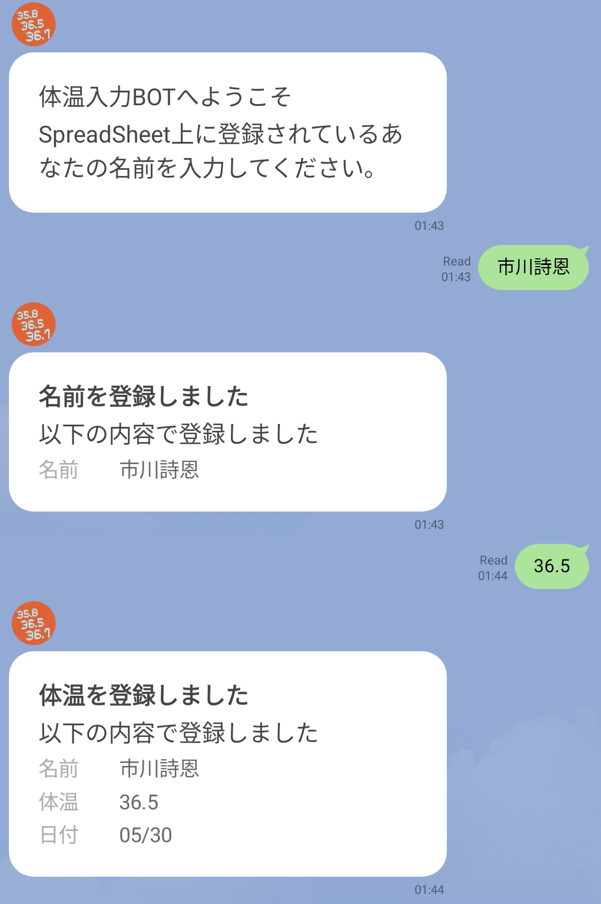

# 学祭検温登録用BOT
## 概要
本プロジェクトはLineBotを通じて横国学祭実行委員内の体温登録作業を容易にするものです。
## 動作要件
### プロジェクトタイプ
Java Webアプリケーション
### 実行環境/要件
- Apache Tomcatでの動作。
- Google Spread Sheetを使うこと
- Google Spread Sheetでの名前欄は上から4行目とする
## セットアップ
※変数(設定名)は半角英字ですべて共通としてください。なるべくわかりやすい命名がいいかも(例:)
### Line Messagingでの設定
Line DevelopersでLineBotアカウントを作成。以下の設定をする。
- BotのWebhook設定を以下のように設定<br>
`(WebアプリケーションのBASE URL)/line/(設定名)`

例: `(WebアプリケーションのBASE URL)/line/hensyu`
- オートリプライ設定、Greeting MessagesをOffに
- (一応確認)応答モードがWebhookになっているかどうか
- チャンネルトークン(長期)を発行、Apache Tomcatの設定にて用いる。

### Google Spread Sheetでの設定
- 対象のスプレッドシートにて`Extensions>Google App Script`を開き、
[このファイルのコード](GASCode.js)をデプロイする。
- デプロイした時に表示されるURLをコピー、`Apache Tomcatの設定`の設定ファイル作成にて使う。
### Apache Tomcatでの設定

1. Json設定ファイルの作成<br>[JSON設定テンプレートファイル](config_templete.json)の形式に従ってJSONファイルを作成し、
Apache Tomcatの実行ユーザーがアクセスアクセス可能な場所に配置する(アクセス権限を解放することを忘れずに)<br>
   - GASUrl: Google Spreadsheetの設定で得たURL
   - name: 設定名、前から使っているものと共通
   - LineMessagingToken: LineMessagingでの設定で得たToken
   - enabled: ボットリクエストの受付を有効にしているかどうか, 有効であればtrue, 無効であればfalseを設定する。
2. 次の場所に設定ファイルを作る。<br>
`(Apache Tomcat実行ユーザーのuser.home)/ShionServerConfig/YNUFES-BodyTempBot/config.properties`<br>
```
BotConfigJson=(前述のJsonファイルまでの絶対パス)
```
3. ビルドしてWARファイルを生成。
4. Apache TomcatのWebappsに、ビルドしたWARファイルをデプロイする
## 使い方
Lineチャット上での操作は次の通りです。
登録に失敗した場合はエラーが表示されます。
